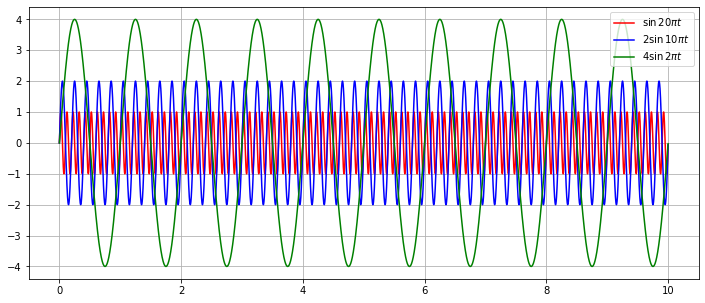

# FFT를 파이썬으로 구현해보자


## 시험데이터 작성

```python
import numpy as np
import matplotlib.pyplot as plt

def sin_wave(amp, freq, time):
  return amp * np.sin(2*np.pi*freq*time)
```

### 데이터 정보

* 시간 간격을 0.001(=1 milli-sec)로 두고 0초 부터 10초까지 시간(time)을 변수로 정의

* 그리고 크기가 각각 1, 2, 4이고 주파수가 각각 10, 5, 1Hz가 되도록 sin1, sin2, sin3라는 데이터

* 각 데이터는 time에 의해 시간축 길이는 10초입니다.

```python
time = np.arange(0, 10, 0.001)
sin1 = sin_wave(1, 10, time)
sin2 = sin_wave(2, 5, time)
sin3 = sin_wave(4, 1, time)
```

### 시험용 데이터 확인

```python
plt.figure(figsize=(12,5))
plt.plot(time, sin1, label=r"$\sin {20\pi} t$", color='red')
plt.plot(time, sin2, label=r"$2\sin {10\pi} t$", color='blue')
plt.plot(time, sin3, label=r"$4\sin {2\pi} t$", color='green')
plt.legend(); plt.grid(); plt.show()
```




## 파이썬을 이용한 fft 구현

* sin_sum -> Time domain 신호 데이터

* Fs -> 샘플 주파수 
* 지금 문제가 csv 파일을 읽지 못하자너 ,,,,,,, -> 내일은 파이썬으로 한번돌려보고 그다음 c++로 fft한번 해봅시다.

```python
import csv
import pandas as pd
f = open(r"test.csv")
f_csv = csv.reader(f)
df = pd.read_csv(f)
```


  \---------------------------------------------------------------------------


  UnicodeDecodeError            Traceback (most recent call last)


  Input In [19], in <cell line: 5>()

​     3 f = open(r"test.csv")

​     4 f_csv = csv.reader(f)

  ----> 5 df = pd.read_csv(f)


  File ~/miniconda3/lib/python3.9/site-packages/pandas/util/_decorators.py:311, in deprecate_nonkeyword_arguments.<locals>.decorate.<locals>.wrapper(*args, **kwargs)

​    305 if len(args) > num_allow_args:

​    306   warnings.warn(

​    307     msg.format(arguments=arguments),

​    308     FutureWarning,

​    309     stacklevel=stacklevel,

​    310   )

  --> 311 return func(*args, **kwargs)


  File ~/miniconda3/lib/python3.9/site-packages/pandas/io/parsers/readers.py:680, in read_csv(filepath_or_buffer, sep, delimiter, header, names, index_col, usecols, squeeze, prefix, mangle_dupe_cols, dtype, engine, converters, true_values, false_values, skipinitialspace, skiprows, skipfooter, nrows, na_values, keep_default_na, na_filter, verbose, skip_blank_lines, parse_dates, infer_datetime_format, keep_date_col, date_parser, dayfirst, cache_dates, iterator, chunksize, compression, thousands, decimal, lineterminator, quotechar, quoting, doublequote, escapechar, comment, encoding, encoding_errors, dialect, error_bad_lines, warn_bad_lines, on_bad_lines, delim_whitespace, low_memory, memory_map, float_precision, storage_options)

​    665 kwds_defaults = _refine_defaults_read(

​    666   dialect,

​    667   delimiter,

​    (...)

​    676   defaults={"delimiter": ","},

​    677 )

​    678 kwds.update(kwds_defaults)

  --> 680 return _read(filepath_or_buffer, kwds)


  File ~/miniconda3/lib/python3.9/site-packages/pandas/io/parsers/readers.py:575, in _read(filepath_or_buffer, kwds)

​    572 _validate_names(kwds.get("names", None))

​    574 # Create the parser.

  --> 575 parser = TextFileReader(filepath_or_buffer, **kwds)

​    577 if chunksize or iterator:

​    578   return parser


  File ~/miniconda3/lib/python3.9/site-packages/pandas/io/parsers/readers.py:934, in TextFileReader.__init__(self, f, engine, **kwds)

​    931   self.options["has_index_names"] = kwds["has_index_names"]

​    933 self.handles: IOHandles | None = None

  --> 934 self._engine = self._make_engine(f, self.engine)


  File ~/miniconda3/lib/python3.9/site-packages/pandas/io/parsers/readers.py:1236, in TextFileReader._make_engine(self, f, engine)

​    1233   raise ValueError(msg)

​    1235 try:

  -> 1236   return mapping[engine](f, **self.options)

​    1237 except Exception:

​    1238   if self.handles is not None:


  File ~/miniconda3/lib/python3.9/site-packages/pandas/io/parsers/c_parser_wrapper.py:75, in CParserWrapper.__init__(self, src, **kwds)

​     72   kwds.pop(key, None)

​     74 kwds["dtype"] = ensure_dtype_objs(kwds.get("dtype", None))

  ---> 75 self._reader = parsers.TextReader(src, **kwds)

​     77 self.unnamed_cols = self._reader.unnamed_cols

​     79 # error: Cannot determine type of 'names'


  File ~/miniconda3/lib/python3.9/site-packages/pandas/_libs/parsers.pyx:544, in pandas._libs.parsers.TextReader.__cinit__()


  File ~/miniconda3/lib/python3.9/site-packages/pandas/_libs/parsers.pyx:633, in pandas._libs.parsers.TextReader._get_header()


  File ~/miniconda3/lib/python3.9/site-packages/pandas/_libs/parsers.pyx:847, in pandas._libs.parsers.TextReader._tokenize_rows()


  File ~/miniconda3/lib/python3.9/site-packages/pandas/_libs/parsers.pyx:1952, in pandas._libs.parsers.raise_parser_error()


  UnicodeDecodeError: 'utf-8' codec can't decode byte 0xd0 in position 0: invalid continuation byte


\```python

n = len(sin_sum) 

k = np.arange(n)

Fs = 1/0.001

T = n/Fs

freq = k/T 

freq = freq[range(int(n/2))]

\```


\```python

Y = np.fft.fft(sin_sum)/n 

Y = Y[range(int(n/2))]

\```


\```python

fig, ax = plt.subplots(2, 1, figsize=(12,8))

ax[0].plot(time, sin_sum)

ax[0].set_xlabel('Time')

ax[0].set_ylabel('Amplitude'); ax[0].grid(True)

ax[1].plot(freq, abs(Y), 'r', linestyle=' ', marker='^') 

ax[1].set_xlabel('Freq (Hz)')

ax[1].set_ylabel('|Y(freq)|')

ax[1].vlines(freq, [0], abs(Y))

ax[1].set_xlim([0, 20]); ax[1].grid(True)

plt.show()

\```


   


   


\```python


\```


\```python


\```
